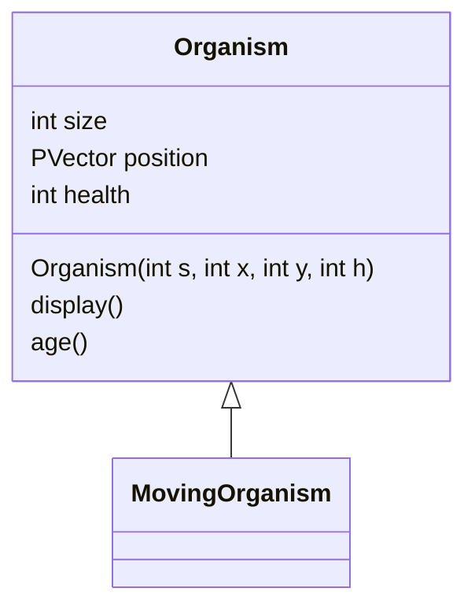

# Aquarium Lab
#### Name:
#### Period:

---
### Instructions
Before break, your work involved making 5 classes in a class hierarchy to be placed inside a fish tank program. for this lab, you will create the fish tank program and use the classes you created in it. Your submission must have the following components:
- The class hierarchy as described in [work05](https://www.stuycs.org/nextcs-dw/2025/02/12/a05.html), including the superclasses `Organism`, `MovingOrganism`, and the three custom subclasses.
  - All fields and methods should be used in some significant way (i.e. the `health` field and `age()` method present in `Organism` should have some effect on the objects), including fields and methods you add to your subclasses.
- Modify this README.md file to include the full class hierarchy UML diagram for your `Organism` tree. (further instructions below).
- A `Tank` class that should be able to:
  - Store organisms using either array(s) or `ArrayList`(s).
  - Have a well defined "floor" section and a well defined "water" section. Your subclasses should either stay within the water (like a fish) or  floor (like a crab) sections, _or_ move differently if it is in the water or floor (like a turtle).
  - Control the organisms contained within.
- A driver file that will:
  - Create a new tank.
  - Populate the tank with some amount of organisms (this can be handled by the tank constructor if you'd like).
  - Provide a way to add new organisms to the take as follows:
    - Clicking the mouse will add an organism at the mouse's position.
    - The type of organism to be add should be set by pressing the number keys (i.e. `1` would be fish, `2` would be turtle, and `3` would be plant.)
    - The current type of organism to be added should be displayed in the upper left corner of the screen.

### Class Hierarchy Diagram
For [work04] you used mermaid to create class diagrams. You will use it here to create the UML class hierarchy diagram for your classes.
- You can find documentation on how to make these diagrams [here](https://mermaid.js.org/syntax/classDiagram.html)
- You can find a live editor [here](https://mermaid.live/edit)
- Below is the beginning of your diagram:

